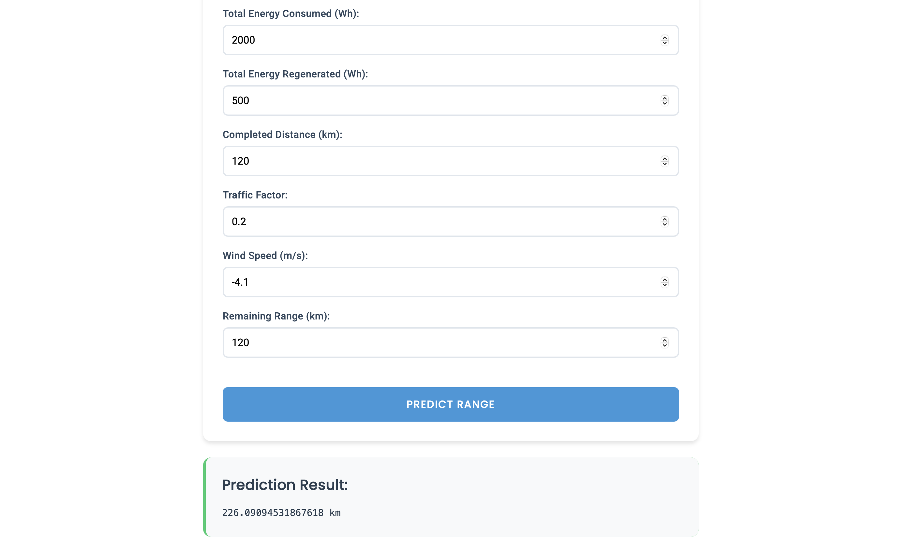

# EV PREDICTION MODELS FRONTEND

## Install Dependencies

Node is required for this project. Run:

```bash
npm install
```
You can now run the app without any other configurations. Just make sure backend is running.

## Run The App

To run the app locally, run:

```bash
ng serve
```

Once the server is running, open your browser and navigate to `http://localhost:4200/`.


Enter all the required values and press the predict button. The request is sent to the backend 
and the model predicts the desired value.


